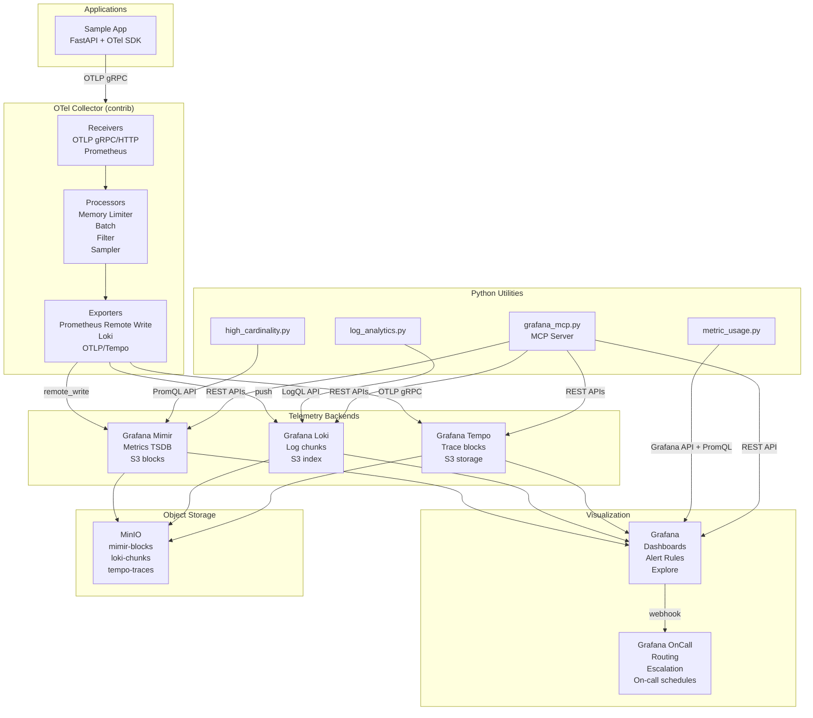

# Architecture

## Data Flow



## Storage Architecture

All three backends (Mimir, Loki, Tempo) use **MinIO** (S3-compatible) as their object store. This gives you a production-realistic setup without cloud dependencies.

| Backend | Bucket | Contents |
|---|---|---|
| Mimir | `mimir-blocks` | TSDB blocks, ruler rules, alertmanager config |
| Loki | `loki-chunks` | Log chunks and index |
| Tempo | `tempo-traces` | Trace blocks |

## Correlation

The stack is wired for **three-pillars correlation**:

- **Traces → Logs**: Tempo datasource configured with `tracesToLogsV2` linking `traceId` to Loki queries
- **Traces → Metrics**: Tempo datasource with `tracesToMetrics` linking to span metric recording rules
- **Logs → Traces**: Loki datasource configured with `derivedFields` extracting `trace_id` from log lines
- **Metrics with Exemplars**: Mimir datasource configured with `exemplarTraceIdDestinations` pointing to Tempo

## Network

All services share a single `observability` bridge network. Ports are exposed to `localhost` for Docker Desktop access:

```
localhost → docker bridge → container
```

## Single-Binary Mode

Mimir, Loki, and Tempo each run in **single-binary mode** (`target: all`) for simplicity. In production you would split these into separate microservices (compactor, ingester, querier, etc.) deployed independently.
