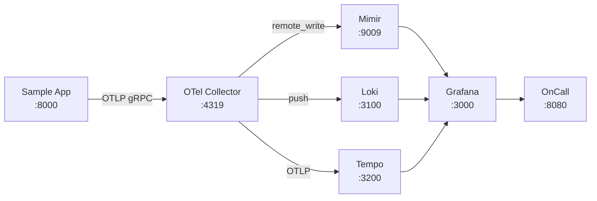

# Observability Playground

A **batteries-included** local observability stack for learning, prototyping, and testing instrumentation strategies.

## What's Included

| Component | Role | Port |
|---|---|---|
| **Grafana Mimir** | Metrics storage (Prometheus-compatible) | 9009 |
| **Grafana Loki** | Log aggregation | 3100 |
| **Grafana Tempo** | Distributed tracing | 3200 |
| **Grafana** | Dashboards & alerting | 3000 |
| **Grafana OnCall** | Incident management | 8080 |
| **OTel Collector** | Telemetry ingestion & routing | 4319 / 4320 |
| **Sample App** | OTel-instrumented FastAPI service | 8000 |
| **MinIO** | Object storage (S3-compatible) | 9000 / 9001 |

## Key Features

- **Three pillars of observability** – metrics, logs, and traces wired together with exemplars and trace/log correlation
- **High-cardinality analyzer** – detect metrics with too many series before they cost you money
- **Log analytics** – cluster error patterns, measure service health, export reports
- **Metric usage** – identify dead metrics never queried in dashboards or alerts
- **Grafana MCP server** – expose all observability data to AI assistants via Model Context Protocol
- **Complete Docker Desktop support** – every port exposed on `localhost`

## Quick Start

```bash
cd observability-playground
make up
```

Then open **[http://localhost:3000](http://localhost:3000)** → admin / admin123

## Architecture at a Glance


